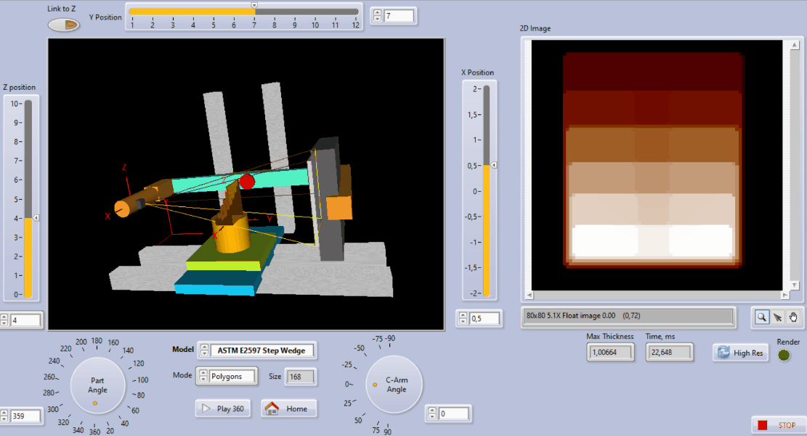

# XRaySimulatorLV
Simple XRay Simulator based on Möller–Trumbore Intersection Algorithm

## Required
NI LabVIEW 2019 x64 (should work also with 32-bit version); NI VDM (Vision Development Toolkit); MS Visual Studio 2019 (Community Edition 16.5.2 was used)

## Links
https://en.wikipedia.org/wiki/Möller–Trumbore_intersection_algorithm

## Demo
### ASTM E2597 StepWedge IQI

